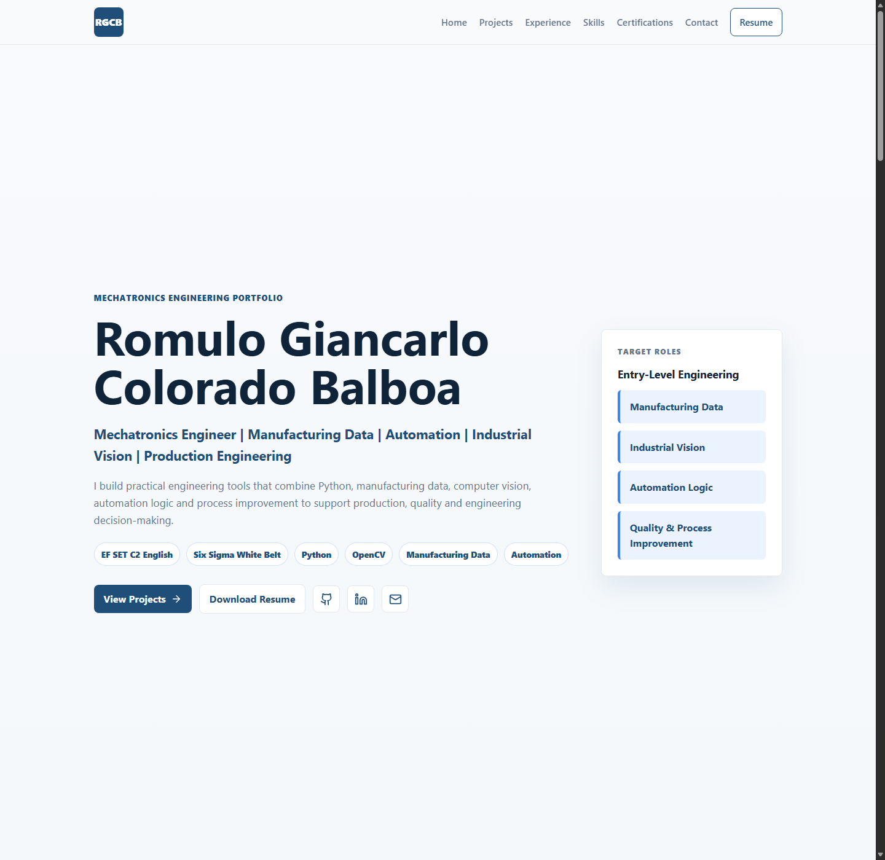

# Romulo Colorado - Engineering Portfolio

Recruiter-first professional portfolio for Romulo Giancarlo Colorado Balboa, a Mechatronics Engineer focused on manufacturing analytics, quality engineering, industrial computer vision, PLC automation, test and validation.

## Live Site

https://rgcb01.github.io

## Preview



## Project Overview

This React/Vite site presents a professional engineering portfolio for New College Graduate and entry-level roles across:

- Manufacturing engineering
- Process engineering
- Quality engineering
- Automation and controls
- Production engineering
- Test and validation
- Semiconductor manufacturing engineering

The content is data-driven and highlights three flagship engineering projects:

- Manufacturing OEE Dashboard
- Automated Visual Quality Inspection
- Industrial Automation Cell Simulator

It also includes technical publications, reusable case study pages, GitHub engineering activity, credentials, engineering metrics, skills and recruiter-oriented role fit.

## Tech Stack

- React
- Vite
- CSS
- lucide-react icons
- GitHub Pages
- GitHub Actions

## Run Locally

```bash
npm install
npm run dev
```

## Build

```bash
npm run build
```

The build creates `dist/404.html` from the compiled app so GitHub Pages can serve SPA routes such as `/personal` and `/projects/manufacturing-oee-dashboard`.

## Trophy Room

The personal site includes a PlayStation Trophy Room at `/personal/trophies`.

Its data is intentionally split into three layers:

- PSN data: trophy facts synchronized by `scripts/sync-trophies.mjs` with `psn-api`.
- IGDB data: game metadata and images enriched during sync through Twitch/IGDB credentials.
- Manual data: personal ratings, reviews and opinions in `src/data/trophies/personalTrophyData.js`.

Generated external data is written only to:

```txt
public/data/generated/
  psn-profile.json
  trophy-games.json
  trophy-details/
```

These files must be safe to publish. Do not put NPSSO values, access tokens, refresh tokens, IGDB client secrets or Twitch secrets in React, public JSON, generated HTML or committed source files.

### Trophy Room Credentials

Local sync and GitHub Actions sync expect these environment variables:

```bash
PSN_NPSSO=
IGDB_CLIENT_ID=
IGDB_CLIENT_SECRET=
```

For local setup, copy `.env.example` into your own uncommitted shell/environment setup and fill the values there. To get an NPSSO, sign into PlayStation in a browser and visit Sony's ssocookie endpoint while signed in. Treat the NPSSO like a password.

For GitHub Actions, configure repository secrets with the same names:

- `PSN_NPSSO`
- `IGDB_CLIENT_ID`
- `IGDB_CLIENT_SECRET`

### Run Trophy Sync Locally

```bash
npm run sync:trophies
npm run validate:trophies
npm run build
```

If credentials are missing or authentication fails, sync exits with a clear error and preserves the last generated dataset. The normal Vite build does not require credentials.

### IGDB Manual Overrides

PSN title names do not always match IGDB names. Add manual IGDB IDs in:

```txt
src/data/trophies/gameOverrides.js
```

Example:

```js
export const gameOverrides = {
  "NPWR00000_00": {
    igdbId: 12345,
  },
};
```

The sync uses overrides before search matching. Ambiguous or unresolved IGDB matches remain unresolved and use PSN artwork when available.

### Personal Trophy Reviews

Manual opinions live in:

```txt
src/data/trophies/personalTrophyData.js
```

Use the PSN `npCommunicationId` as the key. These values are never overwritten by sync.

```js
export const personalTrophyData = {
  "NPWR00000_00": {
    rating: 9,
    platinumRating: null,
    difficulty: 4,
    enjoyment: 9,
    grind: null,
    missables: null,
    wouldPlatinumAgain: true,
    favoriteTrophy: "",
    review: "",
    developerTake: "",
    favorite: false,
    featured: false,
  },
};
```

The current platinum hunt can be set manually with `trophyRoomSettings.currentPlatinumHunt`. If it is left `null`, the UI uses a conservative recent-progress heuristic and leaves the slot empty when a single candidate is not clear.

### GitHub Actions Trophy Sync

The deploy workflow runs on pushes, manual `workflow_dispatch`, and every 8 hours. When all trophy secrets are present, it synchronizes PSN and IGDB data before building the Pages artifact. Generated JSON is included in the deployment artifact and is not committed back to the repository by the workflow.

## Deploy

This repo uses GitHub Actions for deployment.

Recommended GitHub Pages settings:

1. Go to repository settings.
2. Open Pages.
3. Set source to `GitHub Actions`.
4. Push to `main`.

The workflow at `.github/workflows/deploy.yml` builds the Vite app and publishes the `dist` folder.

## Project Structure

```txt
rgcb01.github.io/
  .github/workflows/deploy.yml
  public/
    assets/
      certificates/
      profile/
      projects/
  src/
    components/
      personal/
      projects/
    data/
      caseStudies.js
      personal.js
      portfolio.js
    App.jsx
    data.js
    main.jsx
    styles.css
  index.html
  package.json
  vite.config.js
```

## Updating Portfolio Content

Most professional content is centralized in:

```txt
src/data/portfolio.js
```

Key data objects:

- `profile`
- `heroBadges`
- `highlights`
- `featuredProjects`
- `publications`
- `githubActivity`
- `caseStudies`
- `personalProfile`
- `upcomingProjects`
- `roadmap`
- `experiences`
- `skillGroups`
- `certifications`

Use accurate project statuses such as `Released`, `Working Prototype`, `In Development` and `Planned`. Portfolio experiments should clearly state when they use synthetic data or software-in-the-loop validation.

## Notes

The recruiter-facing site intentionally avoids personal/gaming content. A separate personal section or site can be added later without changing the professional navigation.

Current non-primary routes:

- `/projects/manufacturing-oee-dashboard`
- `/projects/automated-visual-quality-inspection`
- `/projects/industrial-automation-cell-simulator`
- `/personal`
- `/personal/trophies`
- `/personal/trophies/<game-slug>`

The personal route is intentionally not part of the main recruiter navigation.
